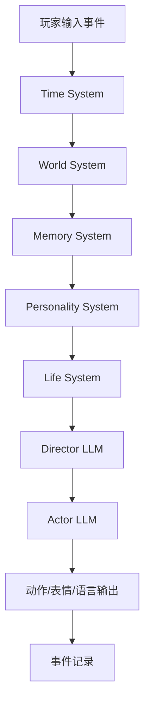
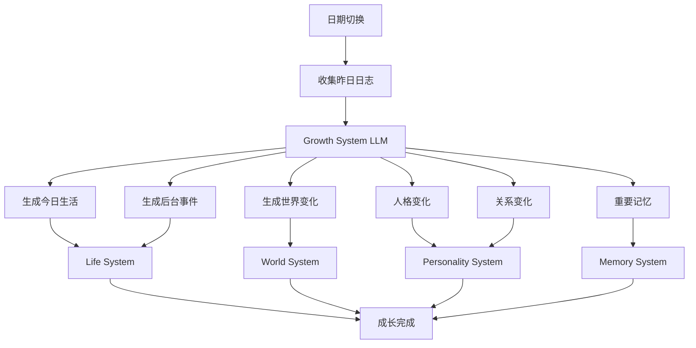
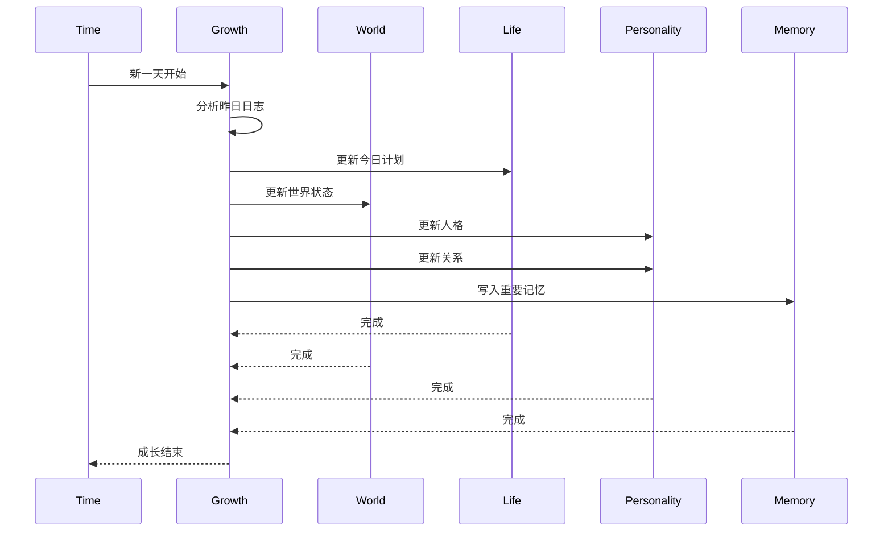
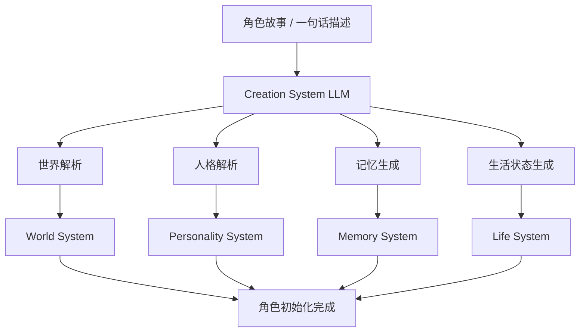
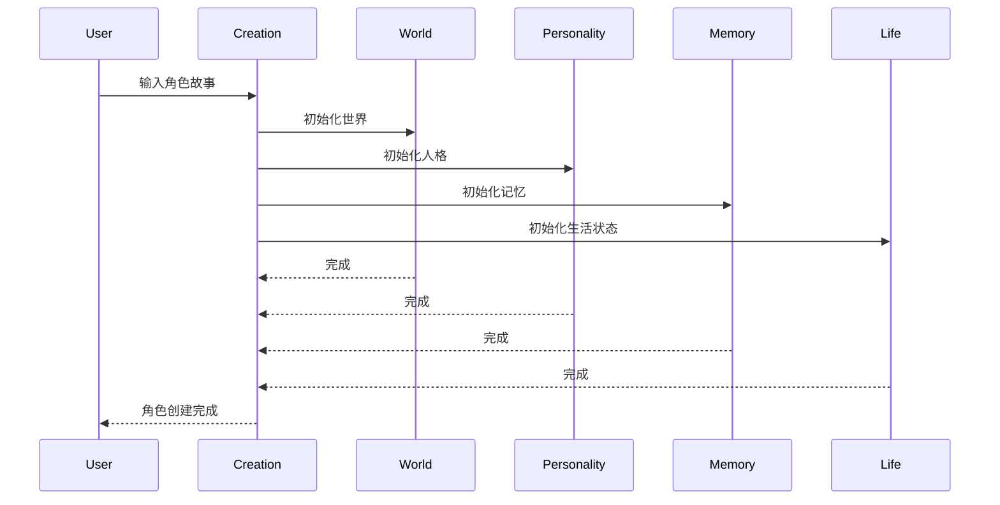

# 项目背景

## 项目概述

随着大语言模型的发展，游戏NPC已经具备自然语言交互能力，但现阶段AI NPC仍然本质上是“被动响应式聊天机器人”。

它们能够回答问题，却无法真正理解自己是谁、身处什么环境、经历过什么事情，以及未来应该如何成长。

玩家获得的是一次次独立的对话，而不是与一个持续存在的角色共同生活。

本项目希望构建一套基于人格、记忆、世界和时间驱动的NPC生命系统，使NPC能够在虚拟世界中持续成长、经历事件、积累记忆并形成稳定人格，从而实现更接近真实生命体的长期互动体验。

------

## 行业现状

当前主流AI NPC方案主要采用：

```text
玩家输入
↓
Prompt组装
↓
LLM生成
↓
角色回复
```

虽然提升了语言自然度，但角色本身仍存在严重缺陷。

无论是游戏NPC还是AI陪伴角色，其智能主要集中于“说什么”，而非“为什么这样说”。

角色缺少对自身、世界和时间的理解，因此无法形成持续成长能力。

------

# 当前痛点分析

## 痛点一：角色世界观不稳定

现有AI角色通常只保存设定文本。

例如：

```text
你是一名酒馆老板
```

但模型并不真正理解：

- 酒馆在哪里
- 城镇是什么样
- 最近发生什么事件
- 自己与其他角色关系如何

因此会出现：

```text
昨天住在王城
今天住在边境
明天又来自海岛
```

角色认知经常发生漂移。

### 本质问题

缺少持续运行的世界模型（World Model）。

------

## 痛点二：角色无法感知当前场景

大多数NPC对话脱离环境。

例如：

玩家站在战场：

```text
村庄已经被攻陷
到处都是尸体
```

NPC却回答：

```text
今天天气真不错
```

因为模型只看到了用户输入。

没有看到：

```text
当前地点
当前时间
周围人物
正在发生的事件
```

### 本质问题

缺少实时场景系统（Scene System）。

------

## 痛点三：角色不会主动推动剧情

现有NPC主要依赖玩家驱动。

玩家不开口：

```text
NPC什么都不会发生
```

导致：

- 世界静止
- 角色静止
- 剧情静止

NPC缺少目标与计划。

### 本质问题

缺少行为驱动系统（Behavior System）。

------

## 痛点四：角色没有自己的生活

玩家离线后：

```text
NPC暂停存在
```

再次上线：

```text
NPC仍然停留在原地
```

现实中的人会：

- 工作
- 睡觉
- 社交
- 产生新经历

而AI NPC不会。

### 本质问题

缺少后台生命模拟系统（Life Simulation）。

------

## 痛点五：记忆缺乏时间组织

当前大部分记忆系统：

```text
向量数据库
+
相似度检索
```

存在问题：

### 时间顺序混乱

NPC可能同时回忆：

```text
三个月前的事情
昨天的事情
十分钟前的事情
```

无法判断先后关系。

------

### 记忆重要性混乱

NPC可能记住：

```text
你喜欢吃苹果
```

却忘记：

```text
你救过他的命
```

------

### 记忆激活错误

在当前情境下不相关的记忆被频繁召回。

导致角色行为异常。

### 本质问题

缺少时间驱动的记忆编排系统（Temporal Memory System）。

------

## 痛点六：人格不会成长

当前人格设定：

```text
勇敢
善良
乐观
```

从创建到删除始终不变。

而真实人格会受到：

- 时间
- 经历
- 关系
- 创伤
- 成功

影响。

例如：

```text
乐观
↓
战争经历
↓
谨慎
↓
背叛经历
↓
冷漠
```

人格应当是动态演化的。

### 本质问题

缺少人格演化系统（Personality Evolution）。

------

# 用户分析

## 核心用户

### RPG玩家

需求：

- 角色拥有成长轨迹
- 剧情能够持续发展
- 关系长期演变

他们期待：

> 与一个活着的人互动，而不是聊天窗口。

------

### 开放世界玩家

需求：

- 世界持续运行
- NPC拥有自己的生活

他们期待：

> 即使我离线，世界仍在运转。

------

### AI陪伴用户

需求：

- 长期陪伴
- 共同经历
- 情感积累

他们期待：

> 角色能够和自己一起成长。

------

# 产品定位

## 产品定义

> 一套基于人格、世界、时间和记忆驱动的NPC生命系统，为游戏角色提供持续存在、自主成长和长期演化能力。

------

## 核心定位

不是：

```text
AI聊天系统
```

也不是：

```text
AI NPC系统
```

而是：

```text
NPC生命模拟系统
```

------

## 差异化定位

传统方案：

```text
用户输入
↓
LLM
↓
输出
```

人格方案：

```text
用户输入
↓
人格
↓
记忆
↓
LLM
↓
输出
```

我们的方案：

```text
用户输入
↓
世界系统
↓
场景系统
↓
时间系统
↓
记忆编排
↓
人格状态
↓
行为决策
↓
LLM
↓
输出
↓
经历生成
↓
人格演化
```

------

# 一句话产品定位

> **构建拥有时间感、世界感和成长能力的AI数字生命NPC系统。让NPC不再只是会说话，而是真正在世界中生活。**

------

我认为你这次的思考已经从“产品设计”进入了“认知架构设计”。

而且有一个很重要的转变：

> 导演不再负责决策，而负责聚焦。

这个区别非常大。

------

# 功能架构 V1

## 一、时间系统（Time System）

职责：

```
管理时间状态
管理日期推进
管理时间事件
```

提供：

```
get()
update()
next_day()
```

------

## 二、世界系统（World System）

职责：

```
管理角色所处世界
管理场景状态
管理环境信息
```

提供：

```
get()
update()
```

------

## 三、记忆系统（Memory System）

职责：

```
管理经历
筛选经历
写入经历
```

提供：

```
get()
write()
update()
```

------

## 四、人格系统（Personality System）

职责：

```
管理人格特征
管理关系状态
管理长期目标
```

提供：

```
get()
update()
```

------

## 五、生活系统（Life System）

职责：

```
管理日程
管理当前任务
管理生活状态
```

提供：

```
get()
generate()
update()
```

------

## 六、决策系统（Director）

LLM #1

职责：

```
聚焦注意力

筛选重要信息

构建当前状态
```

输出：

```
{
  "emotion":"",
  "focus_memories":[],
  "goal":"",
  "style":""
}
```

------

## 七、行为系统（Actor）

LLM #2

职责：

```
动作生成

表情生成

语言生成
```

输出：

```
{
  "action":"",
  "expression":"",
  "speech":""
}
```

------

## 八、成长系统（Evolution System）

LLM #3

定位：

> Growth System（成长系统）

负责：

```
生成今天发生什么
↓
分析这些事造成什么影响
↓
更新角色和世界
```

------

### 职责一：环境演化

输入：

```
当前世界状态
当前时间
角色长期目标
昨日事件日志
```

输出：

```
{
  "today_schedule":[],
  "generated_events":[],
  "world_changes":[]
}
```

例如：

```
{
  "today_schedule":[
      "上午在铁匠铺工作",
      "下午采购物资"
  ],

  "generated_events":[
      "市场遇到老朋友"
  ],

  "world_changes":[
      "酒馆装修完成"
  ]
}
```

------

更新：

```
LifeSystem
WorldSystem
```

------

### 职责二：人格演化

输入：

```
昨日完整日志
角色当前人格
角色关系状态
重要经历
```

输出：

```
{
  "personality_delta":{},
  "relation_delta":{},
  "important_memories":[]
}
```

例如：

```
{
  "personality_delta":{
      "optimism":+2,
      "trust":-1
  },

  "relation_delta":{
      "player":+5
  },

  "important_memories":[
      "玩家送给自己鲜花"
  ]
}
```

------

更新：

```
PersonalitySystem
MemorySystem
```

## 九、创建系统（Creation System）

LLM #0

新增模块。

------

### 功能1：故事导入

输入：

```
角色完整故事
```

例如：

```
艾琳出生于边境村庄，
父亲是铁匠，
15岁加入骑士团，
曾参与北境战争...
```

------

输出：

```
{
  "world":{},
  "personality":{},
  "memory":[],
  "life":{}
}
```

并自动初始化：

```
WorldSystem
MemorySystem
PersonalitySystem
LifeSystem
```

------

### 功能2：一句话生成

输入：

```
落魄贵族少女
```

------

LLM自动扩展：

```
背景故事

人格

初始记忆

生活状态

长期目标
```

完成角色冷启动。

# 系统架构

## 交互 Runtime

#### 调用流程图




#### 时序图

```mermaid
sequenceDiagram

participant User
participant Time
participant World
participant Memory
participant Personality
participant Life
participant Director
participant Actor

User->>Time: 输入事件

Time->>World: 获取场景

World->>Memory: 获取相关记忆

Memory->>Personality: 获取人格

Personality->>Life: 获取当前生活状态

Life->>Director: 聚合状态

Director->>Actor: 高亮事件+当前状态

Actor-->>User: 动作+表情+语言

Actor->>Memory: 写入事件记录
```


------

## 成长 Runtime 

#### 调用流程图




#### 时序图




------

## 创建 Runtime

#### 调用流程图




#### 时序图




