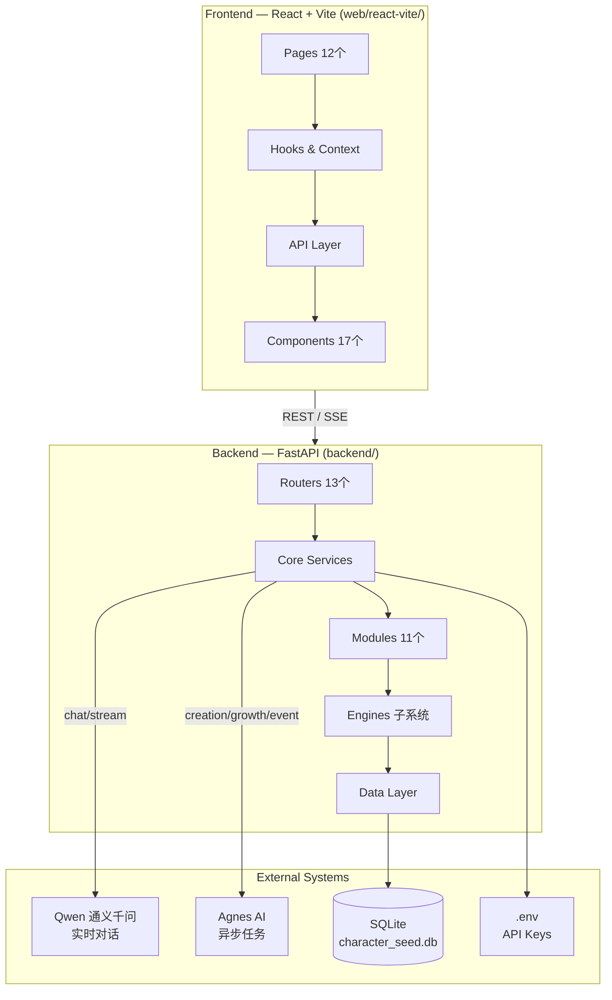
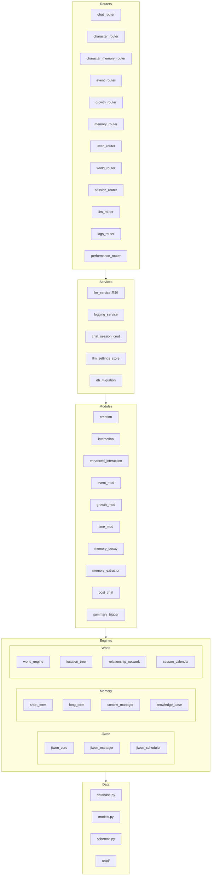
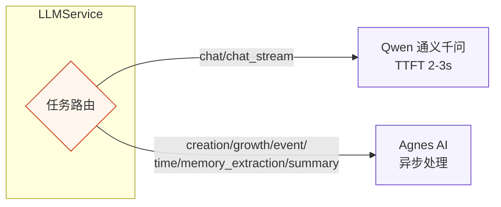
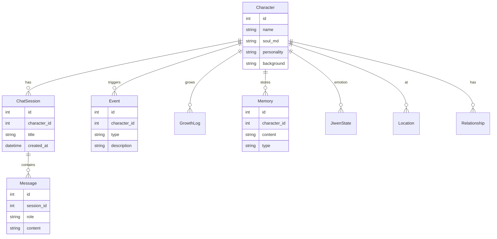

# CharacterSeed 代码架构关系图

> 基于 CodeGraph 分析：194 文件，3,463 节点，7,365 条边

## 系统概览



## 前端架构

```mermaid
graph LR
    subgraph Pages
        ChatPage
        CreatePage
        EventsPage
        GrowthPage
        MemoryPage
        WorldPage
        SettingsPage
        StatusPage
        CharacterDetailPage
        JiwenPage
        LogsPage
    end
    
    subgraph Hooks
        useCharacters
        useSessions
        useKeyboard
        useLocalStorage
        useToast
    end
    
    subgraph Context
        ApiProvider
        CharactersProvider
    end
    
    subgraph API
        api.js
        realApi.js
    end
    
    Pages --> Hooks
    Hooks --> Context
    Context --> API
    API -->|HTTP| Backend
```



## 后端架构



## Task Routing 规则



## 数据模型关系



## 关键依赖关系

| 模块 | 依赖 |
|------|------|
| `chat_router` | `llm_service`, `chat_session_crud`, `post_chat` |
| `character_router` | `character.py` (crud), `world_engine` |
| `event_router` | `event.py` (crud), `event` (module) |
| `growth_router` | `growth.py` (crud), `growth` (module) |
| `memory_router` | `memory.py` (crud), `short_term`, `long_term` |
| `jiwen_router` | `jiwen_manager`, `jiwen_scheduler` |
| `world_router` | `world_engine`, `location_tree`, `relationship_network` |
| `llm_service` | `llm_settings_store`, `.env`, Qwen/Agnes API |
| `post_chat` | `llm_service`, `memory_extractor`, `event` (module) |

## 文件结构总览

```
luyan/CharacterSeed/
├── backend/
│   ├── api/              # 13 个 Router
│   ├── crud/             # 数据访问层
│   ├── jiwen/            # 情绪引擎
│   ├── memory/           # 记忆系统
│   ├── modules/          # 业务模块 (11个)
│   ├── prompts/          # LLM 提示词
│   ├── services/         # 核心服务
│   ├── world/            # 世界引擎
│   ├── config.py         # 配置
│   ├── database.py       # 数据库连接
│   ├── main.py           # FastAPI 入口
│   ├── models.py         # ORM 模型
│   └── schemas.py        # Pydantic Schema
├── web/react-vite/
│   ├── src/
│   │   ├── components/   # 17 个组件
│   │   ├── hooks/        # 自定义 Hooks
│   │   ├── pages/        # 12 个页面
│   │   ├── router/       # 路由配置
│   │   ├── utils/        # 工具函数
│   │   ├── ApiContext.jsx
│   │   ├── CharactersContext.jsx
│   │   └── App.jsx
│   └── vite.config.js
└── tests/                # 测试用例
```
