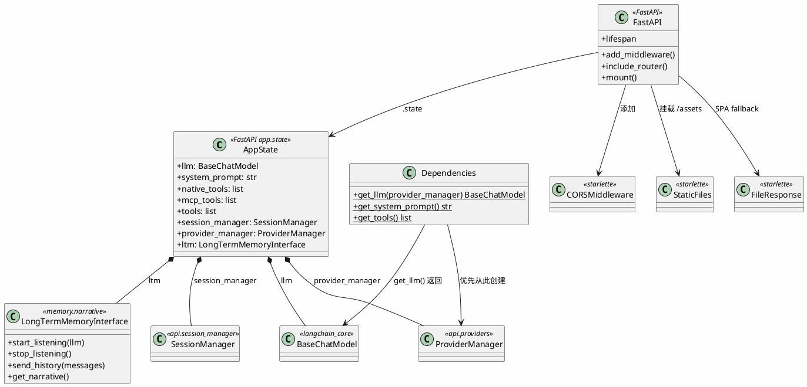

# 应用核心 — 应用工厂与依赖



## 包结构

```
api/
├── server.py             # create_app() — FastAPI 应用工厂 + lifespan
├── dependencies.py       # get_llm, get_system_prompt, get_tools
```

## 生命周期流程

```
FastAPI lifespan (startup)
  ├─ ProviderConfigStore → ProviderManager.load_all()
  ├─ get_llm(provider_manager) → BaseChatModel
  ├─ get_system_prompt() → str
  ├─ get_tools() → list[BaseTool]
  ├─ SessionManager()
  ├─ LongTermMemoryInterface → start_listening()
  ├─ init_mcp_tools() → mcp_tools
  └─ tools = native_tools + mcp_tools

FastAPI lifespan (shutdown)
  ├─ close_mcp()
  └─ ltm.stop_listening()
```
