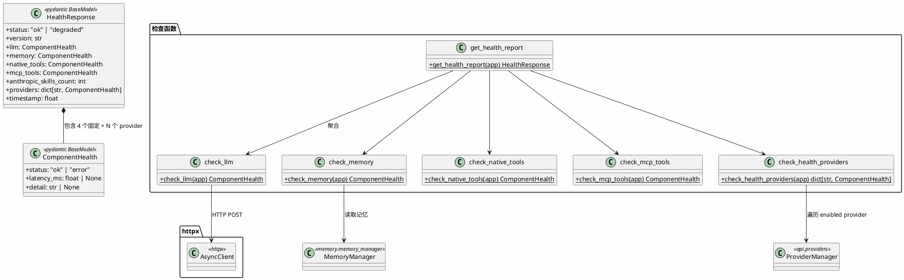

# 健康检查 — Health Check



## 包结构

```
api/
└── health.py             # 健康检查路由 handler 和各部件检查函数
```

## 决策说明

- **LLM 健康缓存 30 秒**：避免每条健康检查请求都调用模型 API
- **聚合状态**：所有部件均为 ok → overall ok；任一 error → overall degraded
- **Provider 并行检查**：多个 enabled provider 通过 `asyncio.gather` 同时检查
