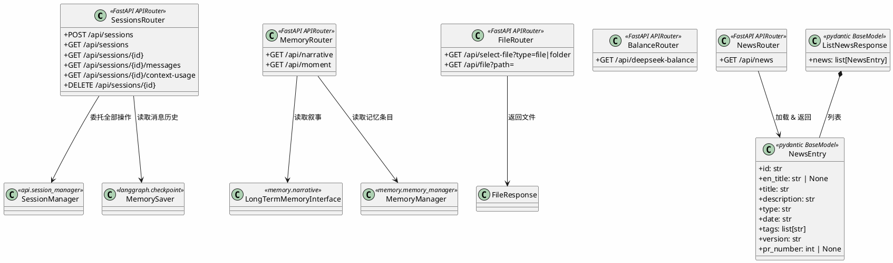

# REST 路由 — 业务端点



## 包结构

```
api/routes/
├── __init__.py
├── sessions.py    # 会话 CRUD
├── memory.py      # 长期记忆叙事
├── files.py       # 本地文件服务
├── balance.py     # DeepSeek 余额查询
├── news.py        # 系统更新动态
└── providers.py   # Provider CRUD（见 Bay Project UML）
```

## 路由挂载（server.py）

| Router          | Prefix   | 说明                     |
|-----------------|----------|--------------------------|
| sessions        | `/api`   | 会话 CRUD + 消息查询     |
| memory          | `/api`   | 长期记忆叙事读取         |
| files           | `/api`   | 本地文件选择与提供       |
| balance         | `/api`   | DeepSeek 余额查询        |
| chat            | 无       | WebSocket `/ws/chat/{id}` |
| providers       | `/api`   | Provider CRUD            |
| news            | `/api`   | 系统更新动态             |
